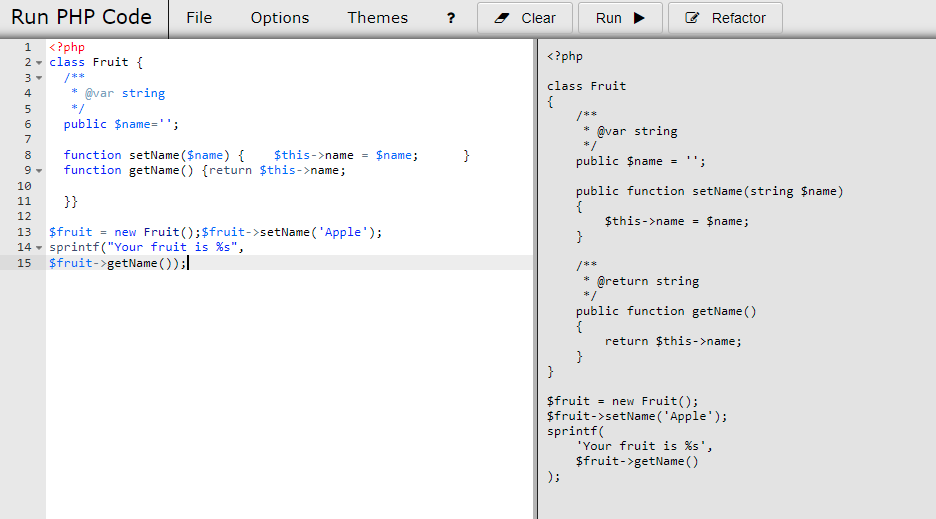

# Run PHP Code

Based on [https://github.com/websiteduck/Run-PHP-Code](https://github.com/websiteduck/Run-PHP-Code)

This script gives you the ability to quickly test snippets of PHP code locally from within the browser.

You just need to have Docker installed on your machine; nothing else.

## Docker hub

Retrieve this program on Docker Hub: [https://hub.docker.com/r/cavo789/runcode](https://hub.docker.com/r/cavo789/runcode).

## Using the interface

You can use the program by just getting his image from Docker Hub (see option 1). **This is the easiest/preferred way.**

You can also clone this repository (see option 2). This is only required if you want to be able to change the code like adding new features to the interface. You won't probably choose this option.

### Option 1 - Using Docker Hub

1. Download the image by running `docker pull cavo789/runcode:1.2`,
2. Then create a container by running `docker run --rm -p 88:80 -d --name runcode cavo789/runcode:1.2`,
3. Finally open a tab in your browser and surf to `http://127.0.0.1:88`.

### Option 2 - For development, clone the repository and use Docker too

1. Make a git clone of this repo on your machine,
2. Go inside the folder where you've downloaded the repository,
3. Run `docker build --pull --rm -t cavo789/runcode:1.2 .`,
4. Then run `docker run --rm -p 88:80 -d -v ${PWD}:/var/www/html --name runcode cavo789/runcode:1.2`,
5. From now, you can open the interface using `http://127.0.0.1:88`. If you want to change something, just update the code (like editing the `index.php` page) and refresh the interface to get the newer code.

To update the image on Docker hub, just run something like `docker push cavo789/runcode:1.2`.

To run an interactive bash session: `docker exec -it runcode /bin/bash`

## Features

* Ace code editor
* Run code in the same window or a separate window
* Refactor your code: [phpcbf](https://github.com/squizlabs/PHP_CodeSniffer/), [php-cs-fixer](https://github.com/FriendsOfPHP/PHP-CS-Fixer) and [rector](https://github.com/rectorphp/rector) are executed on the server. You'll then get an improved version of your code.

## Tips

* Pressing <kbd>Ctrl</kbd>-<kbd>Enter</kbd> will run your code.
* Ace supports multiple cursors, just hold <kbd>ctrl</kbd> and click where you want your cursors.
* This app comes with Font Awesome, so you can use the icons in your code. Simply include the css file: `<link rel="stylesheet" href="css/font-awesome.min.css">`

## Original codebase

This version of `Run-PHP-Code` can be retrieved on [https://github.com/websiteduck/Run-PHP-Code](https://github.com/websiteduck/Run-PHP-Code). This current version has been created to make the code easier to use thanks Docker.

